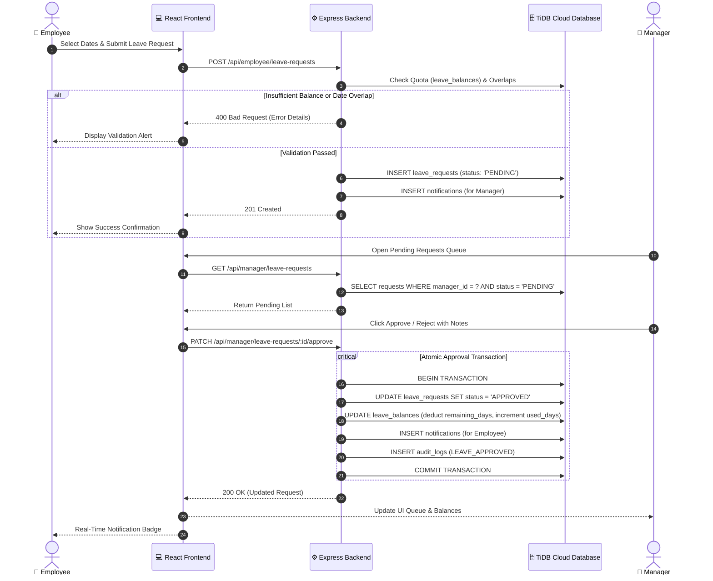
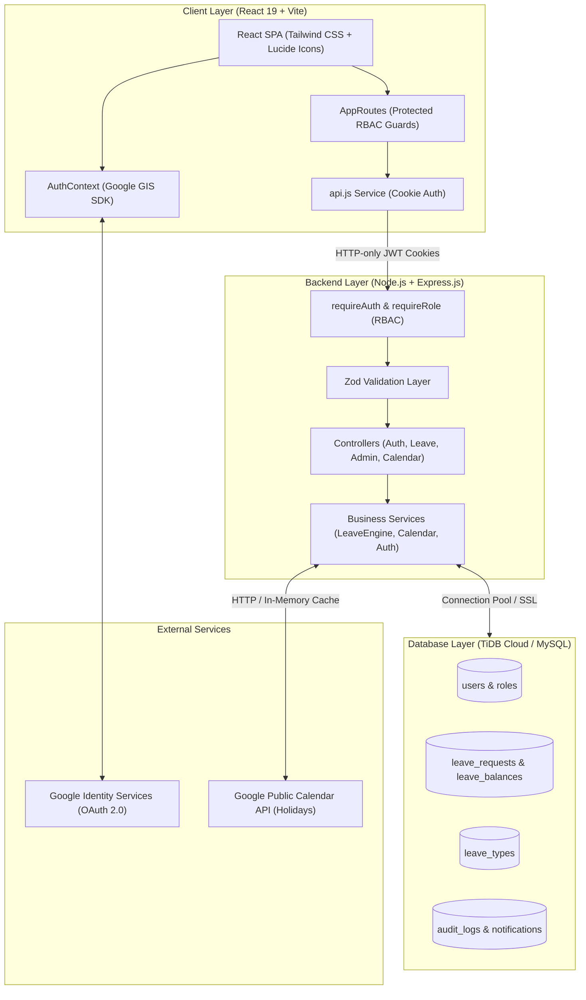
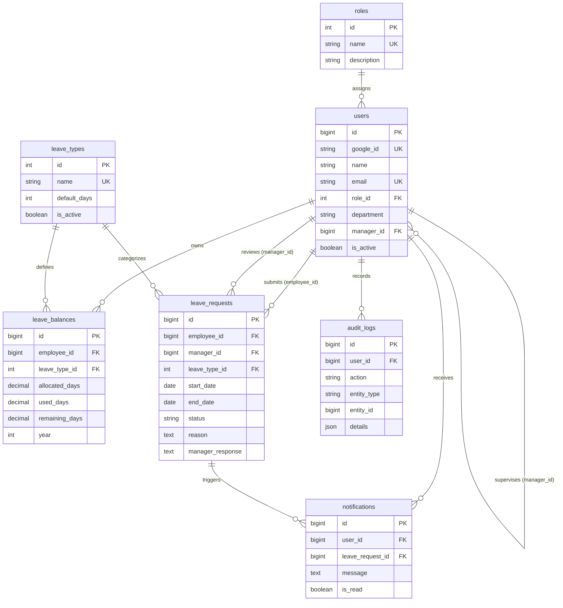

# 🏢 Employee360° — Enterprise Leave Management System

[](https://nodejs.org)
[](https://react.dev)
[](https://vitejs.dev)
[](https://tidbcloud.com)
[](https://developers.google.com/identity)
[](https://tailwindcss.com)
[](https://zod.dev)
[](LICENSE)

An enterprise-grade, role-aware Employee Leave Management System (**Employee360°**) built for modern organizations. Features **Google OAuth 2.0 Single Sign-On (SSO)**, strict **Role-Based Access Control (RBAC)** across three organizational tiers, real-time quota accounting with ACID transaction safety on **TiDB Cloud**, bidirectional **Google Calendar Public Holiday Integration**, RFC 5545 `.ics` export, interactive analytics, and audit logging.

---

## 📑 Table of Contents

- [Project Overview \& Problem Statement](#-project-overview--problem-statement)
- [Key Features](#-key-features)
  - [Employee Portal](#1-employee-portal-role_id-3)
  - [Manager Portal](#2-manager-portal-role_id-2)
  - [Admin Portal](#3-admin-portal-role_id-1)
  - [Shared System Capabilities](#4-shared-system-capabilities)
- [User Roles \& Access Control Matrix](#-user-roles--access-control-matrix)
- [Leave Application \& Approval Workflow](#-leave-application--approval-workflow)
- [System Architecture](#-system-architecture)
- [Technology Stack](#-technology-stack)
- [Project Folder Structure](#-project-folder-structure)
- [Prerequisites \& Environment Variables](#-prerequisites--environment-variables)
- [Database Setup \& Schema](#-database-setup--schema)
- [Google Calendar \& Holidays Integration](#-google-calendar--holidays-integration)
- [Verified REST API Documentation](#-verified-rest-api-documentation)
- [Team Availability Heatmap \& AI Leave Assistant (Status)](#-team-availability-heatmap--ai-leave-assistant)
- [Automated Testing \& Verification](#-automated-testing--verification)
- [Security \& Privacy Implementations](#-security--privacy-implementations)
- [Installation \& Local Development Setup](#-installation--local-development-setup)
- [Execution Roadmap](#-execution-roadmap)
- [Contributing](#-contributing)
- [License](#-license)
- [Authors \& Acknowledgments](#-authors--acknowledgments)

---

## 💡 Project Overview & Problem Statement

Traditional corporate leave management suffers from:
1. **Disconnected Calendars & Holiday Blindspots**: Employees apply for time off without seeing national holidays, leading to fragmented schedules and inefficient use of leave quotas.
2. **Lack of Coverage Visibility**: Managers lack real-time visibility into overlapping leaves among direct reports, risking operational downtime.
3. **Insecure Role Scoping**: Naive client-side authorization allows users to inspect or approve other employees' requests.
4. **Data Race Conditions**: Concurrent approvals can cause negative leave balances without atomic transactions.

**Employee360° solves this** by pairing a **React 19 SPA** with an **Express.js backend** connected to a distributed **TiDB Cloud MySQL** database. All authorization is verified server-side with cryptographic JWT tokens stored in HTTP-only cookies, atomic MySQL transaction rollbacks, real-time in-app notifications, and Google Calendar synchronization.

---

## ✨ Key Features

### 1. Employee Portal (`role_id: 3`)
- **Dashboard & KPIs**: Real-time summary cards displaying remaining leave balance, pending requests, approved requests, and upcoming scheduled leaves.
- **Leave Application Engine**:
  - Pre-validation of requested dates against available quota balances.
  - Overlapping date detection blocking conflicting submissions.
  - Form validation with minimum 10-character reason requirements.
- **My Leave Calendar**:
  - Synchronized calendar grid displaying the employee's approved leaves alongside Google Public Holidays and Company Events.
  - Toggle filters (`Leaves`, `Holidays`, `Company Events`).
  - Month Grid and chronological Agenda list views.
  - 1-Click RFC 5545 `.ics` export for Google Calendar, Apple Calendar, and Outlook.
- **My Leave Quotas**: Detailed breakdown per leave category (Casual, Sick, Earned, Optional Holiday) with interactive utilization progress bars.
- **Self-Service Cancellation**: Employees can cancel `PENDING` requests directly from their portal.

### 2. Manager Portal (`role_id: 2`)
- **Supervisory Dashboard**: Direct reports count, pending approval counter, approved days metric, and upcoming team time-off widgets.
- **Approvals & Rejection Queue**:
  - Modal-based review interface to `APPROVE` or `REJECT` pending requests with supervisor decision notes.
  - Atomic leave balance deduction and automated inbox notification dispatch.
- **Team Leave Calendar**:
  - Unified view of all direct reports' approved leaves, public holidays, and company events.
  - Filter by individual direct report or entire team.
  - Agenda view and `.ics` export for team schedules.
- **Team Balances & Quota Monitoring**: Live visibility into each team member's allocated, used, and remaining days.
- **Team Analytics & Trends**: 12-month leave distribution bar charts, leave type pie charts, and monthly absence trends powered by Recharts.
- **Exportable Leave Reports**: Tabular history with status and date-range filters.

### 3. Admin Portal (`role_id: 1`)
- **System Governance Dashboard**: Global metrics for total users, active employees, active managers, departments, and organization-wide pending leaves.
- **User Management**:
  - Create new Employees and Managers with automatic department and supervisor assignments.
  - Search, role filtering, and activation/deactivation toggles.
  - Safe deletion safeguards preventing deletion of users with historical leave records.
- **Leave Policy Management**:
  - Create and configure corporate leave categories (e.g., Casual, Sick, Earned, Sabbatical) with custom default allocations.
  - Update policies and toggle active/inactive status.
- **System-Wide Analytics & Auditing**:
  - Comprehensive organizational absence analytics.
  - Immutable audit logs capturing every user creation, deactivation, policy update, and deletion with actor metadata and timestamps.

### 4. Shared System Capabilities
- **Google OAuth 2.0 SSO**: One-tap sign-in via Google Identity Services without password friction.
- **Notifications Center**: Instant in-app alerts on approvals, rejections, cancellations, and new applications with unread badges and "Mark All as Read".
- **Responsive Dark/Light UI**: Built with modern glassmorphic slate styling, smooth micro-animations, and full mobile accessibility.

---

## 👥 User Roles & Access Control Matrix

| Role | `role_id` | Portal Base Route | Permissions & Scope |
| :--- | :---: | :--- | :--- |
| **Admin** | `1` | `/admin` | System-wide governance; manage all users; configure global leave policies; view organization-wide analytics & audit logs. |
| **Manager** | `2` | `/manager` | Approve/reject leave requests for direct reports (`manager_id = user.id`); view team calendar, balances, analytics, and reports. |
| **Employee** | `3` | `/employee` | Apply for leaves; view own quotas & requests; cancel own pending requests; view personal calendar and public holidays. |

> 🔒 **Security Principle**: Roles are strictly verified on the backend from the TiDB database upon every request. The frontend route guards (`ProtectedRoute.jsx`) prevent UI leakage, while backend middleware (`requireAuth`, `requireRole`) blocks unauthorized API requests with HTTP `403 Forbidden`.

---

## 🔄 Leave Application & Approval Workflow



---

## 🏛 System Architecture



---

## 🛠 Technology Stack

| Layer | Technology | Purpose |
| :--- | :--- | :--- |
| **Frontend Framework** | React 19.2 + React DOM 19 | Component architecture & modern state management |
| **Build Tool** | Vite 8.3 | Ultra-fast HMR and optimized production bundling |
| **Styling & Icons** | Tailwind CSS 3.4 + Lucide React | Glassmorphic design system and UI iconography |
| **Data Visualization** | Recharts 3.10 | Interactive 12-month analytics & quota breakdown charts |
| **Client Routing** | React Router DOM 7.18 | Declarative client-side routing with RBAC guards |
| **Backend Runtime** | Node.js (ES Modules) | Server execution environment |
| **HTTP Framework** | Express 4.21 | REST API framework, cookie-parser, CORS |
| **Database** | TiDB Cloud (MySQL 8.0+) | Distributed SQL database with ACID transactions |
| **DB Client** | mysql2 (Connection Pool) | High-performance MySQL driver with SSL/TLS support |
| **Authentication** | Google OAuth 2.0 (`google-auth-library`) | Verified Google ID token validation |
| **Session Security** | JSON Web Tokens (`jsonwebtoken`) | Cryptographic session tokens stored in HTTP-only cookies |
| **Data Validation** | Zod 3.24 | Strict schema validation for dates, queries, and mutations |
| **Calendar Sync** | RFC 5545 iCalendar (`.ics`) | Universal calendar export for Google Calendar / Outlook |

---

## 📂 Project Folder Structure

```text
Leave_Management/
├── client/                               # Frontend Application (React + Vite)
│   ├── src/
│   │   ├── components/                   # UI & Reusable Components
│   │   │   └── common/
│   │   │       ├── LoadingSpinner.jsx    # Animated loading spinner
│   │   │       └── ProtectedRoute.jsx    # RBAC Route Guard
│   │   ├── context/
│   │   │   └── AuthContext.jsx           # Session management & user state
│   │   ├── layouts/
│   │   │   └── MainLayout.jsx            # Shell header, responsive nav & notification bell
│   │   ├── pages/
│   │   │   ├── admin/                    # Admin Portal Pages (role_id: 1)
│   │   │   │   ├── AdminDashboard.jsx
│   │   │   │   ├── Analytics.jsx
│   │   │   │   ├── LeavePolicies.jsx
│   │   │   │   ├── LeaveReports.jsx
│   │   │   │   ├── UserFormModal.jsx
│   │   │   │   └── UserManagement.jsx
│   │   │   ├── auth/
│   │   │   │   └── LoginPage.jsx         # Google SSO One-Tap Login
│   │   │   ├── common/
│   │   │   │   └── Notifications.jsx     # User inbox notifications
│   │   │   ├── employee/                 # Employee Portal Pages (role_id: 3)
│   │   │   │   ├── ApplyLeave.jsx
│   │   │   │   ├── EmployeeDashboard.jsx
│   │   │   │   ├── LeaveBalances.jsx
│   │   │   │   ├── LeaveRequestDetails.jsx
│   │   │   │   ├── MyLeaveCalendar.jsx   # Google Calendar + Approved Leaves + ICS
│   │   │   │   └── MyLeaveRequests.jsx
│   │   │   └── manager/                  # Manager Portal Pages (role_id: 2)
│   │   │       ├── LeaveAnalytics.jsx
│   │   │       ├── LeaveHistory.jsx
│   │   │       ├── LeavePolicies.jsx
│   │   │       ├── LeaveReports.jsx
│   │   │       ├── ManagerDashboard.jsx
│   │   │       ├── ManagerRequestDetails.jsx
│   │   │       ├── PendingRequests.jsx
│   │   │       ├── ReviewModal.jsx
│   │   │       ├── TeamBalances.jsx
│   │   │       └── TeamLeaveCalendar.jsx # Team-wide Google Calendar + Filter
│   │   ├── routes/
│   │   │   └── AppRoutes.jsx             # Role-based route definitions
│   │   ├── services/
│   │   │   └── api.js                    # API fetch methods with cookie credentials
│   │   ├── App.jsx                       # App entry with AuthProvider
│   │   ├── index.css                     # Tailwind CSS entry
│   │   └── main.jsx                      # DOM mount bootstrap
│   ├── index.html                        # HTML shell & Google Identity script
│   ├── package.json
│   ├── tailwind.config.js
│   └── vite.config.js
│
├── server/                               # Backend REST API (Node.js + Express)
│   ├── src/
│   │   ├── config/
│   │   │   └── env.js                    # Environment parsing & validation
│   │   ├── controllers/                  # HTTP Request Controllers
│   │   │   ├── adminController.js
│   │   │   ├── authController.js
│   │   │   ├── calendarController.js     # Google Calendar events & ICS export
│   │   │   ├── healthController.js
│   │   │   └── leaveController.js        # Leave application, review, balance calculations
│   │   ├── db/
│   │   │   ├── index.js                  # mysql2 connection pool
│   │   │   ├── initDb.js                 # DDL migration runner
│   │   │   └── seedDb.js                 # Idempotent seed runner
│   │   ├── middleware/
│   │   │   ├── auth.js                   # requireAuth & requireRole RBAC middleware
│   │   │   ├── errorHandler.js           # Centralized JSON error response handler
│   │   │   └── notFoundHandler.js        # 404 handler
│   │   ├── routes/
│   │   │   ├── adminRoutes.js            # /api/admin/*
│   │   │   ├── authRoutes.js             # /api/auth/*
│   │   │   ├── calendarRoutes.js         # /api/calendar/*
│   │   │   ├── healthRoutes.js           # /api/health/*
│   │   │   ├── index.js                  # Root router aggregator
│   │   │   └── leaveRoutes.js            # /api/employee/*, /api/manager/*, /api/leave-types
│   │   ├── services/
│   │   │   ├── adminService.js
│   │   │   ├── authService.js
│   │   │   ├── calendarService.js        # Google Holidays API & RFC 5545 generator
│   │   │   └── leaveService.js           # Atomic quota transactions & overlapping checks
│   │   ├── test/                         # Automated Unit & Integration Tests
│   │   │   ├── adminUserTest.js          # Admin user CRUD & policy tests (18 tests)
│   │   │   ├── authTest.js               # Auth & RBAC matrix tests (6 tests)
│   │   │   ├── calendarServiceTest.js    # Google Calendar & ICS tests (16 tests)
│   │   │   └── leaveEngineTest.js        # Leave engine & atomic transaction tests (66 tests)
│   │   ├── utils/
│   │   │   ├── dateUtils.js              # ISO date formatting & duration calculation
│   │   │   ├── jwt.js                    # Token signing & HTTP-only cookies
│   │   │   └── response.js               # Standard response formatting
│   │   ├── validators/
│   │   │   ├── adminValidator.js
│   │   │   ├── authValidator.js
│   │   │   ├── calendarValidator.js      # Zod calendar query schemas
│   │   │   └── leaveValidator.js
│   │   ├── app.js                        # Express app setup & middleware
│   │   └── server.js                     # Server entrypoint
│   └── package.json
│
├── database/                             # SQL DDL & Seed Scripts
│   ├── schema.sql                        # TiDB DDL (7 tables)
│   └── seed.sql                          # Roles, default leave types & dev fixtures
│
├── .env.example                          # Root env template
├── .gitignore
└── README.md                             # Project Documentation
```

---

## ⚙️ Prerequisites & Environment Variables

### Prerequisites
- **Node.js**: `v18.0.0` or higher (Node 20+ recommended)
- **npm**: `v9.0.0` or higher
- **TiDB Cloud Database** (or local MySQL 8.0+ instance)
- **Google Cloud Console Account** (for OAuth 2.0 Client ID)

---

### Backend Environment Configuration (`server/.env`)

Create a `.env` file inside the `server/` directory:

```env
# Server Configuration
PORT=5001
NODE_ENV=development
CLIENT_URL=http://localhost:5173

# TiDB Cloud (MySQL-Compatible Database)
DB_HOST=gateway01.ap-southeast-1.prod.aws.tidbcloud.com
DB_PORT=4000
DB_USER=your_tidb_username
DB_PASSWORD=your_tidb_password
DB_NAME=leave_management_db
DB_SSL_CA=

# Connection Pool Settings
DB_CONNECTION_LIMIT=10
DB_QUEUE_LIMIT=0

# Google OAuth 2.0 (Google Identity Services)
GOOGLE_CLIENT_ID=your_google_client_id.apps.googleusercontent.com

# Google Calendar Integration (Optional API key for live Google public holidays)
GOOGLE_CALENDAR_API_KEY=
DEFAULT_CALENDAR_COUNTRY=en.indian
GOOGLE_COMPANY_CALENDAR_ID=

# JWT Configuration
JWT_SECRET=your_super_secret_jwt_key_at_least_32_characters_long
JWT_EXPIRES_IN=1d

# Session Secret
SESSION_SECRET=your_secure_session_secret_key_here
```

---

### Frontend Environment Configuration (`client/.env`)

Create a `.env` file inside the `client/` directory:

```env
# Backend API Base URL
VITE_API_URL=http://localhost:5001/api

# Google OAuth 2.0 Web Client ID
VITE_GOOGLE_CLIENT_ID=your_google_client_id.apps.googleusercontent.com
```

---

## 🗄️ Database Setup & Schema

The database is built on **TiDB Cloud** and MySQL 8.0+ relational standards, consisting of 7 interconnected tables with foreign key constraints, indexes, and check conditions:



### Initializing and Seeding the Database

From the `server/` directory:

```bash
# 1. Execute DDL migrations (creates all 7 tables)
npm run db:init

# 2. Seed initial roles, leave types, and development accounts
npm run db:seed
```

---

## 📅 Google Calendar & Holidays Integration

The system features a **Google Calendar & Holiday Aggregator** module (`server/src/services/calendarService.js`):

1. **Google Public Holiday Fetching**:
   - Fetches official public/national holidays directly from Google Public Calendar endpoints (`holiday@group.v.calendar.google.com`).
   - Includes a 24-hour in-memory cache to prevent redundant API calls.
   - Graceful fallback: When no external API key is provided or the network is offline, synthesizes verified national holiday catalogs for the requested year.
2. **Company Scheduled Events**:
   - Injects recurring corporate milestones (e.g. Annual Kickoff, Mid-Year Hackathon, Innovation Week, Founder's Day).
3. **Approved Leave Merging**:
   - Merges approved leave records with RBAC scoping (Employee sees own leaves + department team members; Manager sees direct reports; Admin sees company-wide).
4. **RFC 5545 iCalendar (.ics) Export**:
   - Generates compliant `.ics` feeds for 1-click import into Google Calendar, Apple Calendar, and Outlook.

---

## 📡 Verified REST API Documentation

All API endpoints are mounted at `/api`. Protected routes require a valid JWT token via an HTTP-only cookie.

### 1. Authentication & Session (`/api/auth`)

| Method | Route | Role | Description |
| :--- | :--- | :---: | :--- |
| `POST` | `/api/auth/google` | Public | Verify Google ID token, authenticate/register user, and issue HTTP-only JWT cookie. |
| `GET` | `/api/auth/me` | Authenticated | Retrieve authenticated user profile, active role, and manager assignment. |
| `POST` | `/api/auth/logout` | Authenticated | Invalidate session and clear authentication cookie. |

### 2. Common & Notifications (`/api`)

| Method | Route | Role | Description |
| :--- | :--- | :---: | :--- |
| `GET` | `/api/health` | Public | Backend server uptime and timestamp health check. |
| `GET` | `/api/health/db` | Public | TiDB connection pool latency and connectivity test. |
| `GET` | `/api/leave-types` | Authenticated | List all active leave types and default day allocations. |
| `GET` | `/api/notifications` | Authenticated | Fetch paginated inbox notifications for current user. |
| `PATCH` | `/api/notifications/:id/read` | Authenticated | Mark an individual notification as read. |
| `PATCH` | `/api/notifications/read-all` | Authenticated | Mark all notifications as read for current user. |

### 3. Google Calendar & Sync (`/api/calendar`)

| Method | Route | Role | Parameters | Description |
| :--- | :--- | :---: | :--- | :--- |
| `GET` | `/api/calendar/events` | Authenticated | `start_date`, `end_date`, `categories`, `department`, `employee_id` | Unified event stream (Holidays, Company Events, Approved Leaves) with RBAC scoping. |
| `GET` | `/api/calendar/holidays` | Authenticated | `start_date`, `end_date`, `year`, `country_code` | Fetch public holidays for specified date range. |
| `GET` | `/api/calendar/export/ics` | Authenticated | `year`, `include_holidays` | Download RFC 5545 `.ics` iCalendar export file. |

### 4. Employee Leave Operations (`/api/employee`)

| Method | Route | Role | Description |
| :--- | :--- | :---: | :--- |
| `GET` | `/api/employee/leave-balances` | Employee (3) | Get current year quota allocations, used days, and remaining days per category. |
| `POST` | `/api/employee/leave-requests` | Employee (3) | Submit new leave application with date validation and balance check. |
| `GET` | `/api/employee/leave-requests` | Employee (3) | List employee's leave request history with optional status and month filters. |
| `GET` | `/api/employee/leave-requests/:id` | Employee (3) | Retrieve specific leave request details and manager review notes. |
| `PATCH` | `/api/employee/leave-requests/:id/cancel` | Employee (3) | Cancel an existing `PENDING` leave request. |
| `GET` | `/api/employee/stats` | Employee (3) | Dashboard summary metrics (balances, pending count, upcoming leaves). |

### 5. Manager Leave Operations (`/api/manager`)

| Method | Route | Role | Description |
| :--- | :--- | :---: | :--- |
| `GET` | `/api/manager/leave-requests` | Manager (2) | List direct reports' leave requests with status, employee, and month filters. |
| `GET` | `/api/manager/leave-requests/:id` | Manager (2) | Get team leave request details for review. |
| `PATCH` | `/api/manager/leave-requests/:id/approve` | Manager (2) | Approve leave request atomically and deduct employee balance. |
| `PATCH` | `/api/manager/leave-requests/:id/reject` | Manager (2) | Reject leave request with supervisor feedback note. |
| `GET` | `/api/manager/team-balances` | Manager (2) | View quota balances across all direct reports. |
| `GET` | `/api/manager/stats` | Manager (2) | Manager dashboard KPI metrics. |
| `GET` | `/api/manager/analytics` | Manager (2) | 12-month team absence trends and category distribution breakdown. |
| `GET` | `/api/manager/reports` | Manager (2) | Paginated team leave reports for reporting and auditing. |

### 6. Admin Governance (`/api/admin`)

| Method | Route | Role | Description |
| :--- | :--- | :---: | :--- |
| `GET` | `/api/admin/stats` | Admin (1) | Organization-wide dashboard metrics (users, managers, pending leaves). |
| `GET` | `/api/admin/users` | Admin (1) | Paginated, searchable user directory with role and status filters. |
| `GET` | `/api/admin/users/:id` | Admin (1) | Fetch individual user details and manager relationship. |
| `POST` | `/api/admin/users` | Admin (1) | Create new Employee or Manager account. |
| `PATCH` | `/api/admin/users/:id` | Admin (1) | Update user profile, department, or manager assignment. |
| `PATCH` | `/api/admin/users/:id/status` | Admin (1) | Toggle user activation status (`is_active`). |
| `DELETE` | `/api/admin/users/:id` | Admin (1) | Safe deletion of unreferenced user records with audit log. |
| `GET` | `/api/admin/managers` | Admin (1) | Fetch list of active managers for assignment dropdowns. |
| `GET` | `/api/admin/leave-types` | Admin (1) | Manage corporate leave policy categories. |
| `POST` | `/api/admin/leave-types` | Admin (1) | Create new leave type policy with default allocations. |
| `PUT` | `/api/admin/leave-types/:id` | Admin (1) | Update leave policy name and default days. |
| `PATCH` | `/api/admin/leave-types/:id/status`| Admin (1) | Toggle leave policy active status. |
| `DELETE` | `/api/admin/leave-types/:id` | Admin (1) | Delete unreferenced leave policy category. |
| `GET` | `/api/admin/analytics` | Admin (1) | System-wide analytics and annual leave consumption. |
| `GET` | `/api/admin/reports` | Admin (1) | Organization-wide leave reports. |

---

## 📊 Feature Status: Heatmap & AI Assistant

| Feature | Target Phase | Status | Technical Details |
| :--- | :---: | :---: | :--- |
| **Google Calendar Frontend & ICS** | **Phase 1** | **COMPLETED & VERIFIED** | Unified calendar grid, public holidays, company events, category filters, and RFC 5545 `.ics` export on both Employee & Manager portals. |
| **Team Availability Heatmap** | **Phase 2** | **IN PROGRESS** | Endpoint `GET /api/calendar/team-availability` computing daily team coverage rates, low-availability alert threshold sliders, and interactive calendar heatmap. |
| **AI Leave Assistant** | **Phase 3** | **PLANNED** | Grounded LLM Q&A assistant utilizing employee's real database quotas, public holidays, and non-overlapping leave discovery. |

---

## 🧪 Automated Testing & Verification

The codebase includes an automated test suite with **106 passing assertions** across 4 dedicated test suites.

```bash
cd server

# Run Google Calendar & RFC 5545 ICS Export Tests (16 Tests)
npm run test:calendar

# Run Leave Management Engine & Transaction Tests (66 Tests)
npm run test:leave

# Run Admin User Management & Policy Tests (18 Tests)
npm run test:admin

# Run Google Auth & RBAC Matrix Verification Tests (6 Tests)
npm run test:auth
```

### Verified Test Results Summary

```text
======================================================
📊 TEST SUITE SUMMARY (106 / 106 ASSERTIONS PASSED)
======================================================
  ✅ test:calendar  (16/16 Passed) - Zod schemas, Google Holidays, Caching, RBAC Scoping, ICS generator
  ✅ test:leave     (66/66 Passed) - Date math, atomic balance deductions, overlap blocking, cancellation, audit logs
  ✅ test:admin     (18/18 Passed) - User CRUD, manager assignment, policy CRUD, safe deletion, audit logs
  ✅ test:auth      (6/6 Passed)   - JWT signing/verifying, RBAC portal access matrix
======================================================
```

### Frontend Build Verification

```bash
cd client
npm run build
```
```text
✓ built in 457ms (0 errors, 0 warnings)
```

---

## 🔒 Security & Privacy Implementations

1. **Cryptographic JWT in HTTP-Only Cookies**:
   - Session tokens are stored in `httpOnly`, `sameSite: 'lax'` cookies, mitigating XSS token theft.
2. **Server-Enforced RBAC**:
   - Permissions are checked on every API request directly against the database (`users.role_id`).
3. **Data Scope Isolation**:
   - Managers can strictly query leave requests and balances of their direct reports (`manager_id = req.user.id`). Cross-team data access returns `403 Forbidden`.
4. **ACID Transaction Rollbacks**:
   - Balance deductions and approvals run inside MySQL transactions. If any step fails, the entire transaction is rolled back.
5. **No Private API Keys Exposed**:
   - Google OAuth Client Secrets and Service API keys reside exclusively in backend environment variables.
6. **Immutable Audit Logging**:
   - High-impact administrative actions (`USER_CREATED`, `USER_DELETED`, `LEAVE_APPROVED`, `POLICY_UPDATED`) are written to the `audit_logs` table.

---

## 🚀 Installation & Local Development Setup

### 1. Clone Repository & Install Dependencies

```bash
# Clone the repository
git clone https://github.com/dineshnarayannk/Employee-Leave-Management.git
cd Employee-Leave-Management

# Install Backend Dependencies
cd server
npm install

# Install Frontend Dependencies
cd ../client
npm install
```

### 2. Configure Environment Files

Follow the instructions in [Prerequisites & Environment Variables](#-prerequisites--environment-variables) to populate `server/.env` and `client/.env`.

### 3. Initialize & Seed TiDB Database

```bash
cd server
npm run db:init
npm run db:seed
```

### 4. Start Development Servers

Open two terminal windows:

**Terminal 1 (Backend API on port `5001`):**
```bash
cd server
npm start
```

**Terminal 2 (Frontend SPA on port `5173`):**
```bash
cd client
npm run dev
```

Visit **`http://localhost:5173`** in your browser to log in with your Google account.

---

## 🗺 Execution Roadmap

- [x] **Phase 1: Complete Google Calendar Integration**
  - [x] Google Public Holiday integration with 24-hr cache & fallback catalog.
  - [x] RFC 5545 `.ics` calendar subscription export.
  - [x] Employee Calendar with category filters, month/agenda view, and event details modal.
  - [x] Manager Calendar with direct report filtering and team export.
- [ ] **Phase 2: Team Availability Heatmap (In Progress)**
  - [ ] `GET /api/calendar/team-availability` backend calculation service.
  - [ ] Configurable coverage threshold alerts (< 70% low coverage warning).
  - [ ] Interactive Heatmap calendar UI on Manager Portal.
  - [ ] Automated capacity test suite.
- [ ] **Phase 3: AI Leave Assistant (Planned)**
  - [ ] Grounded AI Q&A endpoint based on real user leave balances.
  - [ ] Non-overlapping leave discovery and long-weekend suggestion engine.
  - [ ] Interactive chat drawer on Employee Portal.

---

## 🤝 Contributing

Contributions, issues, and feature requests are welcome!

1. Fork the repository.
2. Create your feature branch (`git checkout -b feature/AmazingFeature`).
3. Commit your changes (`git commit -m 'feat: Add AmazingFeature'`).
4. Push to the branch (`git push origin feature/AmazingFeature`).
5. Open a Pull Request.

---

## 📄 License

This project is open source and available under the [MIT License](LICENSE).

---

## 👨‍💻 Authors & Acknowledgments

- **Lead Developer**: Dinesh ([@dineshnarayannk](https://github.com/dineshnarayannk))
- **Technologies**: Google Cloud Identity, TiDB Cloud, React Team, Tailwind CSS, Vite.


